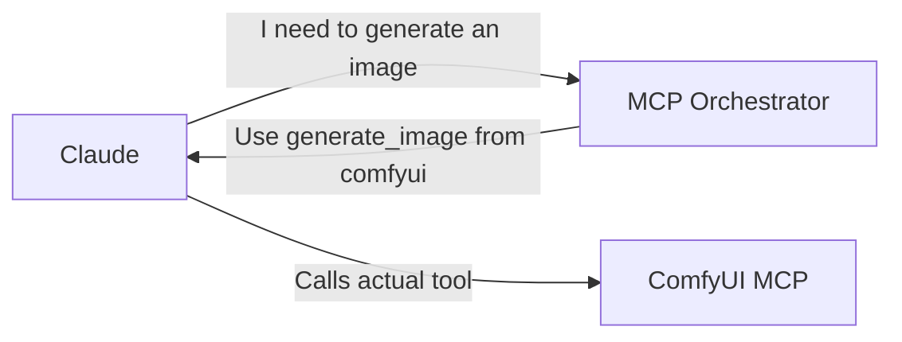

# MCP Orchestrator 🎯

**The ONE MCP to rule them all!**

MCP Orchestrator solves the "too many tools" problem by providing a single, intelligent interface that helps Claude find the right tool among 100+ options. Instead of overwhelming Claude with all those tools, it provides smart routing guidance.

## The Problem It Solves

When you have many MCP servers installed:
- Claude gets confused with too many similar tools
- It's hard to remember which tool does what
- Authentication is scattered across configs
- No central place to discover capabilities

## The Solution

MCP Orchestrator acts as an intelligent tool finder:
- **Single Entry Point**: Claude only sees 4 orchestrator tools
- **Smart Discovery**: Natural language requests find the right tool
- **Tool Guidance**: Returns which actual tool to use
- **Central Registry**: All MCP capabilities in one place

## How It Works



**Important**: The orchestrator doesn't execute tools itself - it tells Claude which tool to use!

## Quick Start

1. **Install MCP Orchestrator**:
```bash
git clone https://github.com/SamuraiBuddha/mcp-orchestrator.git
cd mcp-orchestrator
pip install -e .
```

2. **Start LM Studio** with Granite embeddings model loaded

3. **Configure Claude Desktop** to include the orchestrator alongside your other MCPs:
```json
{
  "mcpServers": {
    "orchestrator": {
      "command": "python",
      "args": ["-m", "mcp_orchestrator"]
    },
    "comfyui": { ... },
    "github": { ... },
    "memory": { ... }
    // Keep all your existing MCPs!
  }
}
```

4. **Restart Claude Desktop**

Now Claude has both the orchestrator AND all your regular tools available!

## Core Tools

### 1. `find_tool(query)`
Discover which MCP and tool to use for a task:
```python
# Ask: "I need to create a logo"
# Returns: 
# **comfyui** → generate_image
#   Confidence: 0.95
#   Description: Generate images using AI
```

### 2. `execute(request, params)`
Get routing information for any request:
```python
# Ask: "generate a robot logo"
# Returns:
# To execute this request, use:
# **Tool**: generate_image
# **From MCP**: comfyui
# **Confidence**: 0.92
# 
# Use the actual `generate_image` tool from the MCP tools list to execute this.
```

### 3. `list_capabilities(category)`
See what's available:
```python
# Ask: list_capabilities("image")
# Returns all image-related tools across all MCPs
```

### 4. `explain_tool(mcp_name, tool_name)`
Get detailed help:
```python
# Ask: explain_tool("github", "create_repository")
# Returns parameters, examples, and best practices
```

## What Makes It Special

### 🌍 Multilingual Support
Using IBM's Granite embeddings, the orchestrator understands requests in any language:
- "Create a logo" 🇺🇸
- "Créer un logo" 🇫🇷  
- "ロゴを作成" 🇯🇵
- "创建标志" 🇨🇳

All route to the same tool!

### 🎯 Intelligent Routing
- Uses semantic embeddings to understand intent
- Handles paraphrases and variations
- Provides confidence scores
- Falls back gracefully when unsure

### 📈 Scales Infinitely
Add new MCPs to the registry and they're immediately discoverable. No need to retrain or reconfigure.

## Architecture Benefits

1. **Reduced Cognitive Load**: Claude focuses on 4 discovery tools instead of 100+ execution tools
2. **Better Tool Discovery**: Find tools by describing what you need
3. **Central Registry**: One place to document all capabilities
4. **Usage Analytics**: See which tools provide the most value
5. **Easier Debugging**: Know exactly which tool will be used

## Real-World Example

**Without Orchestrator**:
- Claude sees 100+ tools with confusing names
- User: "Which one generates images???"
- Claude: *Tries to guess from tool names*

**With Orchestrator**:
- User: "Generate a Crisis Corps logo"
- Orchestrator: "Use `generate_image` from comfyui MCP"
- Claude: *Calls the right tool directly*

## Configuration

The orchestrator is configured via `config/registry.json`. Each MCP entry includes:
- Description and capabilities
- Keywords for better matching
- Tool definitions with examples

## Future Enhancements

- [ ] Web UI for managing MCP registry
- [ ] Automatic MCP discovery
- [ ] Natural language MCP creation
- [ ] Integration with CORTEX for AI orchestration
- [ ] Blockchain-based audit trail
- [ ] Multi-agent coordination

## The Vision

Imagine a world where:
- Adding a new AI capability is as simple as installing an MCP
- Claude automatically knows how to find and use it
- No more tool overload or confusion
- Perfect tool discovery every time

That's what MCP Orchestrator enables.

## Contributing

This orchestrator is designed to grow with your MCP ecosystem. Add new MCPs to the registry and they're immediately discoverable through the unified interface.

## License

MIT License - Use freely in your AI infrastructure!

---

*Built with ❤️ for the AI community by someone who got tired of scrolling through 100+ tools*
