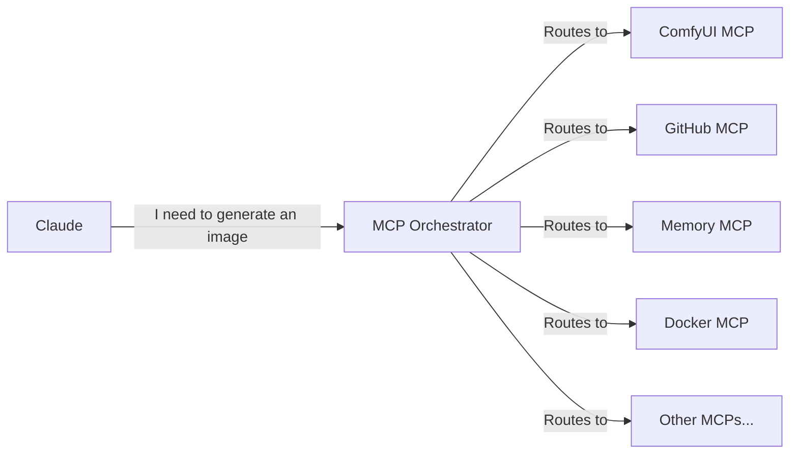

# MCP Orchestrator 🎯

**The ONE MCP to rule them all!**

MCP Orchestrator solves the "too many tools" problem by providing a single, intelligent interface that routes requests to the appropriate MCP servers. Instead of overwhelming Claude with 100+ tools, it only needs to know about the Orchestrator.

## The Problem It Solves

When you have many MCP servers installed:
- Claude gets confused with too many similar tools
- It's hard to remember which tool does what
- Authentication is scattered across configs
- No central place to discover capabilities

## The Solution

MCP Orchestrator acts as an intelligent router:
- **Single Entry Point**: Claude only sees 3-4 orchestrator tools
- **Smart Routing**: Natural language requests get routed to the right MCP
- **Discovery**: Find tools by describing what you need
- **Central Config**: Manage all MCP credentials in one place

## How It Works



## Quick Start

1. **Install MCP Orchestrator**:
```bash
git clone https://github.com/SamuraiBuddha/mcp-orchestrator.git
cd mcp-orchestrator
pip install -e .
```

2. **Start LM Studio** with Granite embeddings model loaded

3. **Configure Claude Desktop** to use ONLY the orchestrator:
```json
{
  "mcpServers": {
    "orchestrator": {
      "command": "python",
      "args": ["-m", "mcp_orchestrator"]
    }
  }
}
```

4. **Restart Claude Desktop**

That's it! Now Claude can access ALL your MCPs through natural language.

## Core Tools

### 1. `find_tool(query)`
Discover which MCP and tool to use for a task:
```python
result = find_tool("I need to create a logo")
# Returns: {"mcp": "comfyui", "tool": "generate_image", "confidence": 0.95}
```

### 2. `execute(request, params)`
Execute a request without knowing which MCP to use:
```python
result = execute(
    "generate a robot logo",
    {"style": "cyberpunk", "size": "1024x1024"}
)
# Automatically routes to ComfyUI MCP
```

### 3. `list_capabilities(category)`
See what's available:
```python
caps = list_capabilities("image")
# Returns all image-related tools across all MCPs
```

### 4. `explain_tool(mcp_name, tool_name)`
Get detailed help:
```python
help = explain_tool("github", "create_repository")
# Returns parameters, examples, and best practices
```

## What Makes It Special

### 🌍 Multilingual Support
Using IBM's Granite embeddings, the orchestrator understands requests in any language:
- "Create a logo" 🇺🇸
- "Créer un logo" 🇫🇷  
- "ロゴを作成" 🇯🇵
- "创建标志" 🇨🇳

All route to the same tool!

### 🧠 Intelligent Routing
- Uses semantic embeddings to understand intent
- Handles paraphrases and variations
- Routes complex requests to multiple MCPs
- Falls back gracefully when unsure

### 📈 Scales Infinitely
Add new MCPs to the registry and they're immediately available. No need to retrain or reconfigure Claude.

## Architecture Benefits

1. **Reduced Cognitive Load**: Claude only needs to understand 4 tools instead of 100+
2. **Dynamic Discovery**: New MCPs can be added without changing configs
3. **Central Management**: One place for all credentials and configs
4. **Better Error Handling**: Orchestrator can retry or fallback
5. **Usage Analytics**: See which tools provide the most value

## Real-World Example

**Before Orchestrator**:
- Claude sees: `create_image`, `generate_image`, `make_image`, `generate_with_sdxl`, `comfyui_generate`, ...
- User: "Which one do I use???"

**After Orchestrator**:
- Claude sees: `execute`
- User: "Generate a Crisis Corps logo"
- Orchestrator: *Routes to ComfyUI automatically*

## Installation

See [INSTALL.md](INSTALL.md) for detailed setup instructions.

## Configuration

The orchestrator is configured via `config/registry.json`. Each MCP entry includes:
- Description and capabilities
- Keywords for better matching
- Command to launch the MCP
- Tool definitions with examples

## Future Enhancements

- [ ] Web UI for managing MCP registry
- [ ] Automatic MCP discovery and installation
- [ ] Load balancing across multiple instances
- [ ] Natural language MCP creation
- [ ] Integration with CORTEX for AI orchestration
- [ ] Blockchain-based memory transactions
- [ ] Multi-agent coordination

## The Vision

Imagine a world where:
- Adding a new AI capability is as simple as installing an MCP
- Claude automatically knows how to use it
- No more tool overload or confusion
- Perfect routing every time

That's what MCP Orchestrator enables.

## Contributing

This orchestrator is designed to grow with your MCP ecosystem. Add new MCPs to the registry and they're immediately available through the unified interface.

## License

MIT License - Use freely in your AI infrastructure!

---

*Built with ❤️ for the AI community by someone who got tired of scrolling through 100+ tools*
