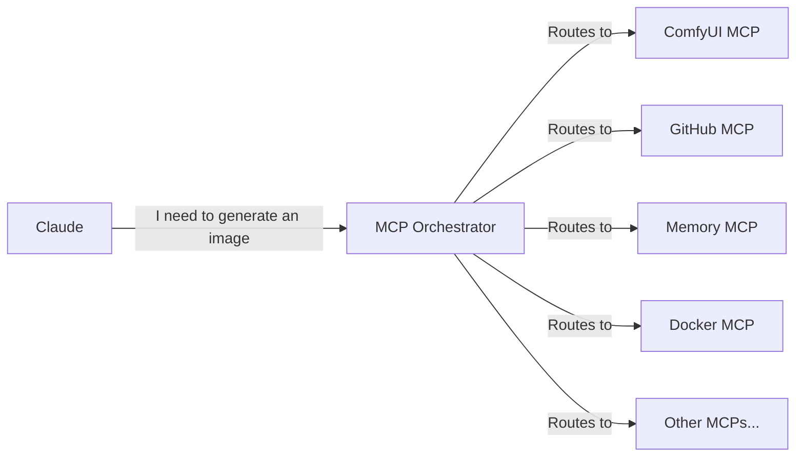

# MCP Orchestrator 🎯

**The ONE MCP to rule them all!**

MCP Orchestrator solves the "too many tools" problem by providing a single, intelligent interface that routes requests to the appropriate MCP servers. Instead of overwhelming Claude with 100+ tools, it only needs to know about the Orchestrator.

## The Problem It Solves

When you have many MCP servers installed:
- Claude gets confused with too many similar tools
- It's hard to remember which tool does what
- Authentication is scattered across configs
- No central place to discover capabilities

## The Solution

MCP Orchestrator acts as an intelligent router:
- **Single Entry Point**: Claude only sees 3-4 orchestrator tools
- **Smart Routing**: Natural language requests get routed to the right MCP
- **Discovery**: Find tools by describing what you need
- **Central Config**: Manage all MCP credentials in one place

## How It Works



## Core Tools

### 1. `find_tool(query)`
Discover which MCP and tool to use for a task:
```python
result = find_tool("I need to create a logo")
# Returns: {"mcp": "comfyui", "tool": "generate_image", "confidence": 0.95}
```

### 2. `execute(request, params)`
Execute a request without knowing which MCP to use:
```python
result = execute(
    "generate a robot logo",
    {"style": "cyberpunk", "size": "1024x1024"}
)
# Automatically routes to ComfyUI MCP
```

### 3. `list_capabilities(category)`
See what's available:
```python
caps = list_capabilities("image")
# Returns all image-related tools across all MCPs
```

### 4. `explain_tool(mcp_name, tool_name)`
Get detailed help:
```python
help = explain_tool("github", "create_repository")
# Returns parameters, examples, and best practices
```

## Installation

1. Clone this repository:
```bash
git clone https://github.com/SamuraiBuddha/mcp-orchestrator.git
cd mcp-orchestrator
```

2. Install dependencies:
```bash
pip install -e .
```

3. Configure your MCPs in `config/registry.json`

4. Update your Claude Desktop config to use ONLY the orchestrator:
```json
{
  "mcpServers": {
    "orchestrator": {
      "command": "python",
      "args": ["-m", "mcp_orchestrator"]
    }
  }
}
```

## Configuration

### Registry Format

The `config/registry.json` file maps capabilities to MCPs:

```json
{
  "mcps": {
    "comfyui": {
      "description": "AI image generation with Stable Diffusion",
      "command": "python",
      "args": ["-m", "mcp_comfyui"],
      "capabilities": [
        "generate images",
        "create logos",
        "AI art",
        "stable diffusion"
      ],
      "tools": {
        "generate_image": {
          "description": "Generate an image from text",
          "examples": ["robot logo", "landscape painting"]
        }
      }
    },
    "github": {
      "description": "GitHub repository management",
      "capabilities": [
        "create repository",
        "manage code",
        "pull requests",
        "version control"
      ]
    }
  }
}
```

### Authentication

Store MCP credentials in `config/credentials.json`:
```json
{
  "github": {
    "token": "${GITHUB_TOKEN}"
  },
  "openai": {
    "api_key": "${OPENAI_API_KEY}"
  }
}
```

## Advanced Features

### Intelligent Routing
- Uses embeddings to match natural language to capabilities
- Learns from usage patterns
- Can route to multiple MCPs for complex requests

### Performance
- Caches MCP connections
- Parallel execution for multi-MCP operations
- Automatic retry with fallbacks

### Monitoring
- Tracks which tools are used most
- Identifies missing capabilities
- Suggests new MCPs to install

## Architecture Benefits

1. **Reduced Cognitive Load**: Claude only needs to understand 4 tools instead of 100+
2. **Dynamic Discovery**: New MCPs can be added without changing configs
3. **Central Management**: One place for all credentials and configs
4. **Better Error Handling**: Orchestrator can retry or fallback
5. **Usage Analytics**: See which tools provide the most value

## Examples

### Simple Request
```python
# Claude just asks for what it needs
execute("check my GitHub notifications")
# Orchestrator figures out to use GitHub MCP's list_notifications tool
```

### Complex Request
```python
# This might use multiple MCPs
execute("create a logo for Crisis Corps and save it to GitHub")
# Routes to: ComfyUI for generation, then GitHub for saving
```

### Discovery
```python
find_tool("I need to analyze some data")
# Returns options from multiple MCPs that can help
```

## Future Enhancements

- [ ] Web UI for managing MCP registry
- [ ] Automatic MCP discovery and installation
- [ ] Load balancing across multiple instances
- [ ] Natural language MCP creation
- [ ] Integration with CORTEX for AI orchestration

## Contributing

This orchestrator is designed to grow with your MCP ecosystem. Add new MCPs to the registry and they're immediately available through the unified interface.

## License

MIT License - Use freely in your AI infrastructure!
