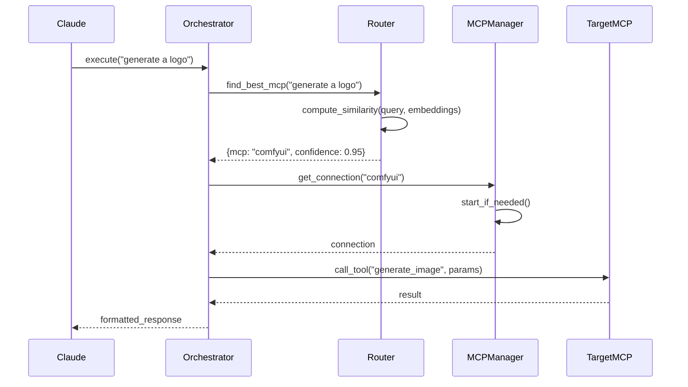

# MCP Orchestrator Architecture

## Overview

The MCP Orchestrator implements a **Tool Router Pattern** to solve the cognitive overload problem when dealing with multiple MCP servers. Instead of exposing 100+ tools directly to Claude, it provides a unified interface that intelligently routes requests.

## Core Components

### 1. Registry System

The registry (`config/registry.json`) maintains metadata about all available MCPs:

```json
{
  "mcp_name": {
    "description": "What this MCP does",
    "capabilities": ["list", "of", "capabilities"],
    "tools": {
      "tool_name": {
        "description": "What this tool does",
        "parameters": {},
        "examples": []
      }
    }
  }
}
```

### 2. Semantic Router

Uses sentence embeddings to match natural language queries to MCP capabilities:

1. Pre-compute embeddings for all MCP capabilities
2. Embed incoming queries
3. Find best match using cosine similarity
4. Route to appropriate MCP with confidence score

### 3. Connection Manager

Manages MCP server lifecycle:

- Lazy loading (start MCPs only when needed)
- Connection pooling
- Health checks and auto-restart
- Credential injection

### 4. Response Aggregator

For complex requests that might need multiple MCPs:

- Query planning
- Parallel execution
- Result combination
- Error handling and fallbacks

## Request Flow



## Key Design Decisions

### 1. Single Entry Point

- Claude's config only includes the orchestrator
- All other MCPs are accessed through it
- Reduces configuration complexity

### 2. Semantic Routing

- Natural language understanding built-in
- No need to memorize exact tool names
- Graceful handling of ambiguous requests

### 3. Dynamic Discovery

- MCPs can be added/removed without config changes
- Self-documenting through the registry
- Version management capabilities

### 4. Centralized Authentication

- All credentials in one secure location
- Environment variable substitution
- No credentials in Claude's config

## Performance Optimizations

### 1. Embedding Cache

- Pre-compute all capability embeddings
- Update only when registry changes
- Fast similarity search

### 2. Connection Pooling

- Keep frequently-used MCPs running
- Configurable timeout for idle connections
- Warm-start for better latency

### 3. Parallel Execution

- Identify independent operations
- Execute on multiple MCPs simultaneously
- Aggregate results efficiently

## Security Considerations

### 1. Credential Management

- Credentials never exposed to Claude
- Environment variable substitution
- Separate credentials file from registry

### 2. MCP Isolation

- Each MCP runs in its own process
- No direct MCP-to-MCP communication
- Orchestrator mediates all interactions

### 3. Audit Trail

- Log all routing decisions
- Track tool usage patterns
- Monitor for anomalies

## Future Enhancements

### 1. Learning System

- Track successful routes
- Improve routing over time
- User feedback integration

### 2. Multi-Step Planning

- Decompose complex requests
- Create execution plans
- Handle dependencies

### 3. Fallback Strategies

- Multiple MCPs for same capability
- Automatic failover
- Load balancing

### 4. Plugin System

- Custom routing logic
- Request/response transformation
- Middleware capabilities
